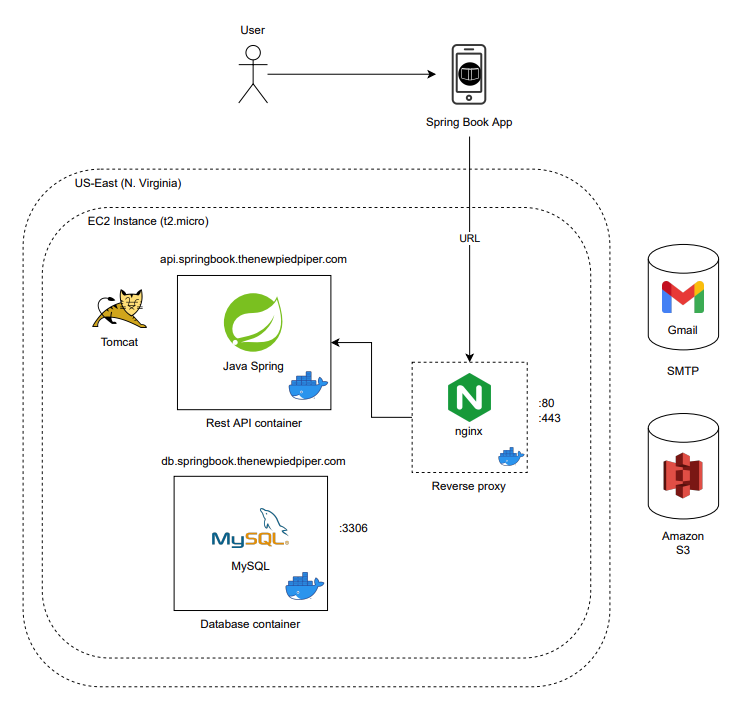

# Spring Book
Mobile App for Spring Book

## What is this?
Spring Book is a hybrid mobile application (iOS and Android) that allows the user to keep a record of their read books and access the functions available to apply a series of techniques that facilitate the understanding, memorization, and application of concepts learned at reading.

 

## Rest API
The application uses a Rest API developed in Spring Framework and uses MySQL as a database. The API is available at 
https://github.com/ososuna/spring-book-api.git

## Entity Relationship Diagram

## Class Diagram

## Architecture Diagram

